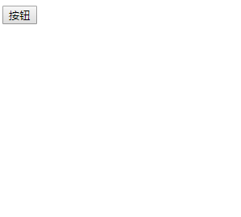
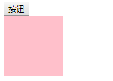
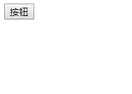
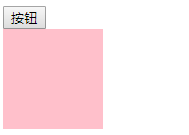
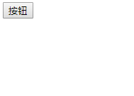
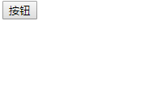
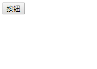
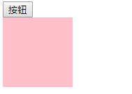
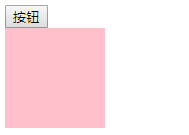

## jquery特殊效果

```
fadeIn() 			淡入  opacity
fadeOut() 			淡出
fadeToggle()		切换淡入淡出
hide() 				隐藏元素  dispay:none
show() 				显示元素
toggle() 			切换元素的可见状态
slideDown() 		向下展开  height
slideUp() 			向上卷起
slideToggle() 		依次展开或卷起某个元素

使用方式: 

$('div').fadeIn()
```

例如: 

```html
<head>
    <style>
        .box {
            width: 100px;
            height: 100px;
            background-color: pink;
            display:none;
        }
    </style>
    <script src="./jquery-1.12.4.min.js"></script>
    <script>
        $(function(){
            $('.btn').click(function(){
                $('.box').fadeIn()
            })
        })
    </script>
</head>
<body>
    <button class="btn">按钮</button>
    <div class="box"></div>
</body>
```

显示效果: 

`fadeIn()效果:`



`fadeOut( )效果:`



`fadeToggle( )效果: `

​								
`hide()效果:`



`show()效果:`



`toggle()效果:`



`slideDown()效果:`



`slideUp()效果:`



`slideToggle()效果:`




### 总结: 

- jquery 帮助我们封装了一些特殊的动画效果, 我们可以直接调用这些动画效果来实现一部分常见的操作
- 这些动画效果的使用方式都是一样的:  1. 找到当前标签      2. 调用标签的对应动画效果
- 使用格式: `$(获取元素).动画效果()`

