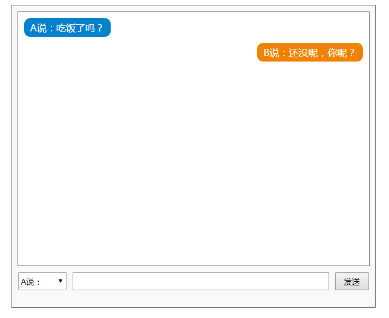

# jquery 属性操作

## html ( )

> 使用: html( ) 取出元素文本 或设置元素内容
>
> 作用类似于 innerHTML( )

```javascript
使用方式: 

// 取出html内容
var $htm = $('#div1').html();

// 设置html内容
$('#div1').html('<span>添加文字</span>');
```


## val( ) 

> val( ) 方法返回或设置被选元素的值。
>
> 元素的值##是通过 value 属性设置的。该方法大多用于 input 元素。
>
> 如果该方法未设置参数，则返回被选元素的当前值。

```javascript
使用方式:

// 取出html内容
var val = $("input").val();

// 设置html内容
$("input").val("Hello World");
```


 

## prop( ) / attr( )  

> attributes : 属性

> 取出或设置某个属性的值
>
> 这里的属性是指标签除 css 样式以外的其他属性

```javascript
使用方式:


// 取出图片的地址
var $src = $('#img1').prop('src');

// 设置图片的地址和alt属性
$('#img1').prop({src: "test.jpg", alt: "Test Image" });
```


例如: 

```html
<head>
    <script src="js/jquery-1.12.4.min.js"></script>
    <script>
        $(function(){
            var $div = $('#div1');
            var $a = $('#link01');
            
            // 读取元素包裹的内容
            var sTr = $div.html();            
            // alert(sTr);

            // 写入或者叫设置元素包裹的内容
            $div.html('改变的文字');

            $div.html('<a href="http://www.baidu.com">百度网</a>')
            $div.html('<ul><li>列表文字</li><li>列表文字</li><li>列表文字</li></ul>');

            // 操作元素标签内除样式之外的其他的属性
            // 读取属性值：
            alert( $a.prop('id') );

            // 写入或者叫设置属性值
            $a.prop({'href':'http://www.itcast.cn','title':'这是去到传智播客的网站的链接'});
            $a.html('传智播客');
        })
    </script>
</head>
<body>
    <div class="box" id="div1">这是一个div</div>
    <a href="#" id="link01">这是一个链接</a>
</body>
```


## 聊天 ---- 课堂练习 

聊天效果展示: 




代码展示: 

```html
<!DOCTYPE html>
<html lang="en">
<head>
    <meta charset="UTF-8">
    <meta name="viewport" content="width=device-width, initial-scale=1.0">
    <meta http-equiv="X-UA-Compatible" content="ie=edge">
    <title>Document</title>
    <style type="text/css">
        .talk_con{
            width:600px;
            height:500px;
            border:1px solid #666;
            margin:50px auto 0;
            background:#f9f9f9;
        }
        .talk_show{
            width:580px;
            height:420px;
            border:1px solid #666;
            background:#fff;
            margin:10px auto 0;
            overflow:auto;
        }
        .talk_input{
            width:580px;
            margin:10px auto 0;
        }
        .whotalk{
            width:80px;
            height:30px;
            float:left;
            outline:none;
        }
        .talk_word{
            width:420px;
            height:26px;
            padding:0px;
            float:left;
            margin-left:10px;
            outline:none;
            text-indent:10px;
        }        
        .talk_sub{
            width:56px;
            height:30px;
            float:left;
            margin-left:10px;
        }
        .atalk{
           margin:10px; 
        }
        .atalk span{
            display:inline-block;
            background:#0181cc;
            border-radius:10px;
            color:#fff;
            padding:5px 10px;
        }
        .btalk{
            margin:10px;
            text-align:right;
        }
        .btalk span{
            display:inline-block;
            background:#ef8201;
            border-radius:10px;
            color:#fff;
            padding:5px 10px;
        }
    </style>
    <script src="./jquery-1.12.4.min.js"></script>
    <script type="text/javascript">      
         $(function(){
            var $words = $('#words');
            var $who = $('#who');
            var $talk = $('#talkwords');
            var $btn = $('#talksub');

            $btn.click(function(){
                // 读取value属性值
                // var sVal = $talk.prop('value');

                // 操作元素的value属性封装成了 val() 方法
                var sVal = $talk.val();
                
                // 清空输入框里面的内容
                // $talk.prop({'value':''});
                $talk.val('');

               
                // 判断输入框是否为空
                if(sVal=='')
                {
                    alert('请输入内容！');
                    return;
                }
                
 			   var sVal02 = $who.prop('value');
                var sTr = '';
                if(sVal02==0)
                {
                    sTr = '<div class="atalk"><span>A说：'+ sVal +'</span></div>';
                }
                else{
                    sTr = '<div class="btalk"><span>B说：'+ sVal +'</span></div>';
                }
                $words.html( $words.html() + sTr);
            })
        })  
    </script>
</head>
<body>
    <div class="talk_con">
        <div class="talk_show" id="words">
            <div class="atalk"><span>A说：吃饭了吗？</span></div>
            <div class="btalk"><span>B说：还没呢，你呢？</span></div>
        </div>
        <div class="talk_input">
            <select class="whotalk" id="who">
                <option value="0">A说：</option>
                <option value="1">B说：</option>
            </select>
            <input type="text" class="talk_word" id="talkwords">
            <input type="button" value="发送" class="talk_sub" id="talksub">
        </div>
    </div>
</body>
</html>
```


