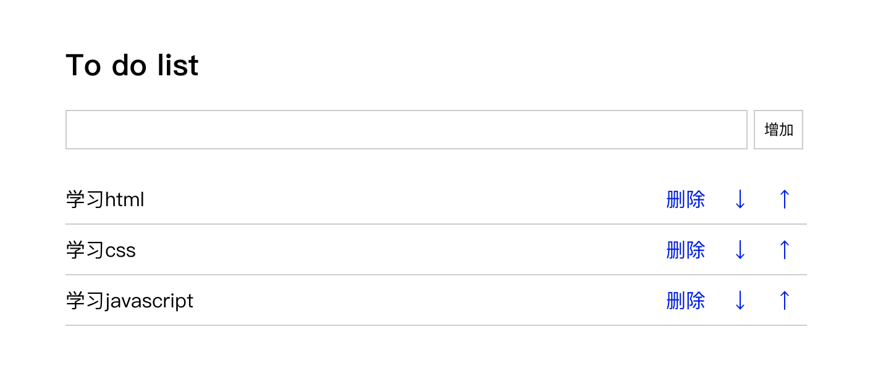

# Dom操作

元素节点操作指的是改变 html 的标签结构，它有两种情况：
1、移动现有标签的位置
2、将新创建的标签插入到现有的标签中


## 创建新标签

```
var $div = $('<div>'); //创建一个空的div
var $div2 = $('<div>这是一个div元素</div>');
```


## 移动或者插入标签的方法

### append( )

> 在元素内部添加，从后面放入

```
使用方法: 

$(selector).append(content)
```

例如:

```html
<head>
    <script src="./jquery-1.12.4.min.js"></script>
    <script>
        $(function(){
            var $div = $('#app')
            var $span = $('<span>这是一个span元素</span>')
            $div.append($span)
        })
    </script>
</head>
<body>
    <div id="app">div元素</div>
</body>
```

效果:

```
div元素这是一个span元素
```


### appendTo( )

> 在元素内部添加，从后面放入

```
使用方式:

$(content).appendTo(selector)
```

例如: 

```html
<head>
    <script src="./jquery-1.12.4.min.js"></script>
    <script>
        $(function(){

            var $div1 = $('#app')
            var $div2 = $('#box')
            
            var $span = $('<span>这是一个span元素11</span>')
            $span.appendTo($div1)

            $('<em>哈哈哈,斜体</em>').appendTo($div2)
        })
    </script>
</head>
<body>
    <div id="app">第一个div元素</div>
    <div id="box">第二个div元素</div>
</body>
```

结果:

```
第一个div元素这是一个span元素11
第二个div元素哈哈哈,斜体
```


### prepend( )

> 在元素内部添加，从前面放入

```
使用方式:

$(selector).prepend(content)
```

例如:

```html
<head>
    <script src="./jquery-1.12.4.min.js"></script>
    <script>
        $(function(){
            var $div1 = $('#app')
            $div1.prepend('<a href="#">a标签</a>')
        })
    </script>
</head>
<body>
    <div id="app">第一个div元素</div>
</body>
```

结果:

```
a标签第一个div元素
```


### prependTo( )

> 在元素内部添加，从前面放入

```
使用方法:

$(content).prependTo(selector)
```

例如:

```html
<head>
    <script src="./jquery-1.12.4.min.js"></script>
    <script>
        $(function(){
            var $div1 = $('#app')
            $('<a href="#">a标签</a>').prependTo($div1)
        })
    </script>
</head>
<body>
    <div id="app">第一个div元素</div>
</body>
```

结果:

```
a标签第一个div元素
```


### after( )

> 在元素外部添加，从后面放入

```
使用方式:

$(selector).after(content)
```

例如:

```html
<head>
    <script src="./jquery-1.12.4.min.js"></script>
    <script>
        $(function(){
            var $div1 = $('#app')
            $div1.after("<em>哈哈,斜体</em>")
        })
    </script>
</head>
<body>
    <div id="app">第一个div元素</div>
</body>
```

结果:

```
第一个div元素
哈哈,斜体                // 斜的,这里可能看不出来...
```


### insertAfter( )：

> 在元素外部添加，从后面放入
>
> 注释：如果该方法用于已有元素，这些元素会被从当前位置移走，然后被添加到被选元素之后。

```
使用方法:

$(content).insertAfter(selector)
```

例如:

```html
<head>
    <script src="./jquery-1.12.4.min.js"></script>
    <script>
        $(function(){
            var $div1 = $('#app')
            $('<em>哈哈,斜体</em>').insertAfter($div1)
        })
    </script>
</head>
<body>
    <div id="app">第一个div元素</div>
</body>
```

结果:

```
第一个div元素
哈哈,斜体
```


### before( )

> 在被选元素前插入指定的内容。 

```
使用方式:

$(selector).before(content)
```

例如:

```html
<head>
    <script src="./jquery-1.12.4.min.js"></script>
    <script>
        $(function(){
            var $div1 = $('#app')
            $div1.before("<em>哈哈,斜体</em>")
        })
    </script>
</head>
<body>
    <div id="app">第一个div元素</div>
</body>
```

结果:

```
哈哈,斜体
第一个div元素
```


### insertBefore( )

> insertBefore() 方法在您指定的已有子节点之前插入新的子节点。

```
使用方式:

$(content).insertBefore(selector)
```

例如:

```html
<head>
    <script src="./jquery-1.12.4.min.js"></script>
    <script>
        $(function(){
            var $div1 = $('#app')
            $('<em>哈哈,斜体</em>').insertBefore($div1)
        })
    </script>
</head>
<body>
    <div id="app">第一个div元素</div>
</body>
```

结果:

```
哈哈,斜体
第一个div元素
```


### 删除标签

```
使用方式: 


$(selector).remove()
```

例如:

```html
<head>
    <script src="./jquery-1.12.4.min.js"></script>
    <script>
        $(function(){
            var $div1 = $('#app')
            $div1.remove()
        })
    </script>
</head>
<body>
    <div id="app">第一个div元素</div>
    <div id="box">第二个div元素</div>
</body>
```

结果:

```
第二个div元素
```


### 总结:

- Dom 元素这里指的就是 HTML标签,有时候大家会听到 DOM树的概念, 那是因为 HTML 中的标签,就像是树一样, 根部是 `<html>`标签, 然后是`<body>`和`<head>`,再然后一级一级往下排,最终形成树形结构
- 我们可以通过 jquery 来动态的修改 HTML 的结构,使用的就是上述的方法
- append( ) 方法可以在元素内部后方, 添加新的元素,   appendTo( ) 也差不多, 只是添加的顺序进行了调换
- prepend( ) 方法可以在元素内部前方, 添加新的元素, prependTo( ) 与之类似, 添加的顺序进行了调换.
- after( ) 方法是指在当前元素外部,从后方插入一个新的元素
- before( ) 这个方法则正好和after( ) 方法相反, 在当前元素前方,插入一个新的元素
- insertBefore( )  则是在指定的元素之前插入子元素, 这些内容大家只需要简单了解, 使用起来的时候能够想的起来即可, 实在是忘记了, 可以到时候查一下文档.
- 删除某个元素不必多说就是:  某个想要删除的元素调用remove( ) 方法即可.


### todolist ---- 课堂练习 

>  todolist (计划列表) 实例



```html
<!DOCTYPE html>
<html lang="en">
<head>
	<meta charset="UTF-8">
	<title>todolist</title>
	<style type="text/css">
		.list_con{
			width:600px;
			margin:50px auto 0;
		}
		.inputtxt{
			width:550px;
			height:30px;
			border:1px solid #ccc;
			padding:0px;
			text-indent:10px;			
		}
		.inputbtn{
			width:40px;
			height:32px;
			padding:0px;
			border:1px solid #ccc;
		}
		.list{
			margin:0;
			padding:0;
			list-style:none;
			margin-top:20px;
		}
		.list li{
			height:40px;
			line-height:40px;
			border-bottom:1px solid #ccc;
		}

		.list li span{
			float:left;
		}

		.list li a{
			float:right;
			text-decoration:none;
			margin:0 10px;
		}
	</style>
	<script type="text/javascript" src="./jquery-1.12.4.min.js"></script>
	<script type="text/javascript">
        $(function(){
            // 增加
            var $input = $('#txt1')
            var $addBtn = $('#btn1')
            var $ul = $('#list')
            $addBtn.click(function(){
                if($input.val() == ''){
                    alert('请输入内容')
                    return
                }

                // $ul.append($input.val())
                $ul.append('<li><span>'+$input.val()+'</span><a href="javascript:;" class="up"> ↑ </a><a href="javascript:;" class="down"> ↓ </a><a href="javascript:;" class="del">删除</a></li>')
                
                $input.val('')
            })

            // 删除
            $ul.delegate('a','click',function(){
                var className = $(this).prop('class')
                if (className == 'up') {
                    if($(this).parent().prev().length == 0){
                        alert('到顶了')
                        return;
                    }
                    $(this).parent().insertBefore( $(this).parent().prev() )
                }
                if(className == 'del'){
                    $(this).parent().remove()
                }
                if(className == 'down'){
                    if($(this).parent().next().length == 0){
                        alert('到底了')
                        return
                    }
                    $(this).parent().insertAfter($(this).parent().next())
                }
            })
        })
	</script>	
</head>
<body>

	<div class="list_con">
	<h2>To do list</h2>
		<input type="text" name="" id="txt1" class="inputtxt">
		<input type="button" name="" value="增加" id="btn1" class="inputbtn">
		
		<ul id="list" class="list">

			<li><span>学习html</span><a href="javascript:;" class="up"> ↑ </a><a href="javascript:;" class="down"> ↓ </a><a href="javascript:;" class="del">删除</a></li>
			<li><span>学习css</span><a href="javascript:;" class="up"> ↑ </a><a href="javascript:;" class="down"> ↓ </a><a href="javascript:;" class="del">删除</a></li>
			<li><span>学习javascript</span><a href="javascript:;" class="up"> ↑ </a><a href="javascript:;" class="down"> ↓ </a><a href="javascript:;" class="del">删除</a></li>
			
		</ul>

	</div>
</body>
</html>
```


