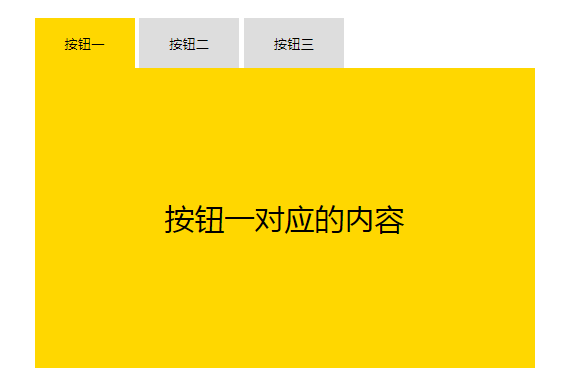

# style绑定

## 用法一:  可以使用一个布尔值来决定样式是否作用到标签上

```html
<div id="app">
   	<!--正常的用法:-->
    <div style="color:red;font-size:30px;">
    <!--vue中的使用方法:-->
    <div v-bind:style="{color: colorName, fontSize: fontName + 'px'}"></div>
</div>

<script>
    var vm = new Vue({
        el:'#app',
        // data属性值如下：
        data:{
			colorName: 'red',
             fontName: 30
        }
    })
</script>
```

## 用法二: 给 style 传一个对象

> 对象中

```html
<div id="app">
   	<!--正常的用法:-->
    <div style="color:red;font-size:30px;">
    <!--vue中的使用方法:-->
    <div v-bind:style="objName"></div>
</div>

<script>
    var vm = new Vue({
        el:'#app',
        // data属性值如下：
        data:{
            objName:{
              	color: 'red',
                fontSize: '30px'  
            }
        }
    })
</script>
```


## 用法三: style 上可以添加数组, 通过数组控制样式的加载

```html
<div id="app">
   	<!--正常的用法:-->
    <div style="color:red;font-size:30px;">
    <!--vue中的使用方法:-->
    <div v-bind:style="[style01, style02]"></div>
</div>

<script>
    var vm = new Vue({
        el:'#app',
        // data属性值如下：
        data:{
            style01:{
                color:'red',
                fontSize:'30px'
            },
            style02:{
                background:'pink'
            }
        }
    })
</script>
```


## 总结:  style可以这样使用: 

```html
<body>
    <div id="app">
        <p :style="{'color':colorName,'fontSize':fontSizeName}">设置style属性的p标签1</p>
        <p :style="sty01">设置style属性的p标签2</p>
        <p :style="[sty01,sty02]">设置style属性的p标签3</p>
    </div>

    <script>
        var vm = new Vue({
            el:'#app',
            data:{
                colorName:'red',
                fontSizeName:'30px',
                sty01:{
                    color:'blue',
                    fontSize:'40px'
                },
                sty02:{
                    background:'gold'
                }
            }
        })
    </script>
</body>
```


## 选项卡 --- 课堂实例

> 选项卡



```html
<!DOCTYPE html>
<html lang="en">
<head>
    <meta charset="UTF-8">
    <meta name="viewport" content="width=device-width, initial-scale=1.0">
    <meta http-equiv="X-UA-Compatible" content="ie=edge">
    <title>Document</title>
    <style>
        .tab_con{
            width:500px;
            height:350px;
            margin:50px auto 0;
        }
        .tab_btns{
            height:50px;
        }
        .tab_btns input{
            width:100px;
            height:50px;
            background:#ddd;
            border:0px;
            outline:none;
        }

        .tab_btns .active{
            background:gold;
        }

        .tab_cons{
            height:300px;
            background:gold;
        }

        .tab_cons div{
            height:300px;
            line-height:300px;
            text-align:center;
            display:none;
            font-size:30px;
        }

        .tab_cons .current{
            display:block;
        }
    </style>
    <script src="js/vue.js"></script>   
</head>

<body>
    <div class="tab_con" id="app">
        <div class="tab_btns">
            <input type="button" value="按钮一" :class="[(iNow==0)?'active':'']" @click="iNow=0">
            <input type="button" value="按钮二" :class="[(iNow==1)?'active':'']" @click="iNow=1">
            <input type="button" value="按钮三" :class="[(iNow==2)?'active':'']" @click="iNow=2">
        </div>
        <div class="tab_cons">
            <div :class="[(iNow==0)?'current':'']">按钮一对应的内容</div>
            <div :class="[(iNow==1)?'current':'']">按钮二对应的内容</div>
            <div :class="[(iNow==2)?'current':'']">按钮三对应的内容</div>
        </div>
    </div>
    <script>
        var vm = new Vue({
            el:'#app',
            data:{
                iNow:0
            }
        })
    </script>
</body>
</html>
```


## 总结: 

- class 和 style 往往就是和v-bind配合使用, 来使 data 中的属性能够加载到 HTML 部分
- 这里用的其实和小胡子语法很像, 但是大家需要注意一个问题:  在标签的属性位置, 不能添加小胡子语法:   也就是说在标签的属性位置不能够出现两个大括号包含使用的情况.    
- class 和 style, 使用的是单个的对象 { }  


