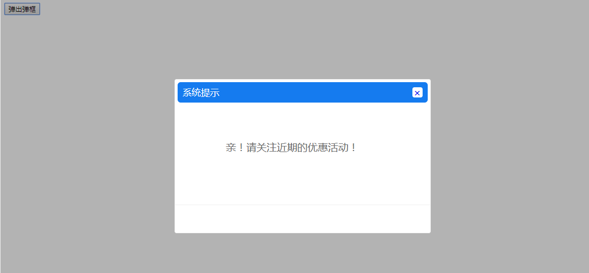

# 事件处理

## 事件绑定方法

> 可以用 v-on 指令监听 DOM 事件，并在触发时运行一些 JavaScript 代码，事件的处理，简单的逻辑可以写在指令中，复杂的需要在vue对象的methods属性中指定处理函数。

```html
<div id="example-1">
  <!-- 在指令中写处理逻辑 -->
  <button v-on:click="counter += 1">Add 1</button>
  <p>The button above has been clicked {{ counter }} times.</p>
</div>


<script>
    var example1 = new Vue({
      el: '#example-1',
      data: {
        counter: 0
      }
    })
</script>
```

methods属性中指定处理函数：

```html
<div id="example-2">
  <!-- greet 是在下面定义的方法名 -->
  <button v-on:click="greet">Greet</button>
</div>


<script>
    var example2 = new Vue({
      el: '#example-2',
      data: {
        name: 'Vue.js'
      },
      // 在 `methods` 对象中定义方法
      methods: {
        greet: function () {
          // `this` 在方法里指向当前 Vue 实例
          alert('Hello ' + this.name + '!')
        }
      }
    })
</script>
```


## 事件修饰符

实际开发中，事件绑定有时候牵涉到阻止事件冒泡以及阻止默认行为，在vue.js可以加上事件修饰符

```html
<!-- 阻止单击事件继续传播 -->
<a v-on:click.stop="func"></a>

<!-- 提交事件不再重载页面 -->
<form v-on:submit.prevent="onSubmit"></form>

<!-- 修饰符可以串联 -->
<a v-on:click.stop.prevent="doThat"></a>

<!-- 只有修饰符 -->
<form v-on:submit.stop.prevent></form>
```

案例: 

```html
<head>
    <style>
        .con{
            width:200px;
            height:200px;
            background:orange;
        }
        .box{
            width:100px;
            height:100px;
            background:gold;
        }
    </style>
    <script src="js/vue.js"></script>
</head>
<body>
    <div id="app">
        <!-- 通过方法来操作要做的事情 -->
        <div class="con" @click="fnAdd">

            <!-- 直接在等号内写要做到事情 -->
            <!-- .stop 可以阻止click事件往上冒泡 -->
            <div class="box" @click.stop="iNum+=1">{{ iNum }}</div>
        </div>
    </div>

    <script>
        var vm = new Vue({
            el:'#app',
            data:{
                iNum:0
            },
            methods:{
                fnAdd:function(){
                    this.iNum +=1;
                }
            }
        })    
    </script>
</body>
```

## 弹框 ---- 课堂实例



> 阻止事件冒泡的弹框

```html
<head>
    <script src="js/vue.js"></script>   
</head>
<body>
<div id="app"  @click="isShow=false">
    <input type="button" value="弹出弹框" id="btn01" @click.stop="isShow=true">
    <div class="pop_main" id="pop" v-show="isShow">
        <!-- 弹框本身制作阻止冒泡的操作 -->
        <div class="pop_con" @click.stop>
            <div class="pop_title">
                <h3>系统提示</h3>
                <a href="#" id="shutoff" @click="isShow=false">×</a>
            </div>
            <div class="pop_detail">
                <p class="pop_text">亲！请关注近期的优惠活动！</p>
            </div>
            <div class="pop_footer">                              
            </div>
        </div>
        <div class="mask"></div>
    </div>
</div>
    
<script>
    var vm = new Vue({
        el:'#app',
        data:{
            isShow:false
        }
    })
</script>
</body>
```


## 总结: 

- vue 框架中绑定事件使用的是 v-on:   我们也可以使用简写的形式: @ 来表示

- 因为我们知道 Dom树 有一些默认行为和默认事件, 但是在某些情况下我们不希望有这些, 所以我们可以使用 @click.stop  或者 @click.prevent  设置两者的联合 @click.stop.prevent 等来阻止这些行为和事件. 这个比较关键, 希望大家都能够好好把握.
