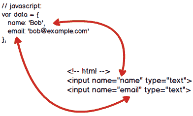

# 表单绑定

> 可以用 v-model 指令在表单` <input>` 及 `<textarea> `元素上创建双向数据绑定。它会根据控件类型自动选取正确的方法来更新元素





## 单行文本框

```html
<input v-model="message" placeholder="edit me">
<p>Message is: {{ message }}</p>
```


## 多行文本框

```html
<span>Multiline message is:</span>
<p>{{ message }}</p>
<textarea v-model="message" placeholder="add multiple lines"></textarea>
```


## 复选框

单个复选框，绑定到布尔值：

```html
<input type="checkbox" id="checkbox" v-model="checked">
<label for="checkbox">{{ checked }}</label>
```

多个复选框，绑定到同一个数组：

```html
<div id='example-3'>
  <input type="checkbox" id="jack" value="Jack" v-model="checkedNames">
  <label for="jack">Jack</label>
  <input type="checkbox" id="john" value="John" v-model="checkedNames">
  <label for="john">John</label>
  <input type="checkbox" id="mike" value="Mike" v-model="checkedNames">
  <label for="mike">Mike</label>
  <br>
  <span>Checked names: {{ checkedNames }}</span>
</div>


<script>
    new Vue({
      el: '#example-3',
      data: {
        checkedNames: []
      }
    })
</script>
```


## 单选框

```html
<div id="example-4">
  <input type="radio" id="one" value="One" v-model="picked">
  <label for="one">One</label>
  <br>
  <input type="radio" id="two" value="Two" v-model="picked">
  <label for="two">Two</label>
  <br>
  <span>Picked: {{ picked }}</span>
</div>

<script>
    new Vue({
      el: '#example-4',
      data: {
        picked: ''
      }
    })
</script>
```


## 下拉框

```html
<div id="example-5">
  <select v-model="selected">
    <option disabled value="">请选择</option>
    <option>A</option>
    <option>B</option>
    <option>C</option>
  </select>
  <span>Selected: {{ selected }}</span>
</div>

<script>
    new Vue({
      el: '...',
      data: {
        selected:''
      }
    })
</script>
```

案例:

```html
<head>
    <script src="js/vue.js"></script>
</head>
<body>
    <div id="app">
        <!-- input 用v-model绑定vue对象里面的一个数据，可以实现双向数据绑定 -->
        <input type="text" v-model="txt01">
        <div>{{ txt01 }}</div>
        <input type="button" value="改变值" @click="txt01=100">
        
        <select v-model="sel01">
            <option value="0">北京</option>
            <option value="1">上海</option>
            <option value="2">广州</option>
            <option value="3">深圳</option>
        </select>
        <div>{{ sel01 }}</div>
    </div>
    <script>
        var vm = new Vue({
            el:'#app',
            data:{
               txt01:'',
               sel01:0 
            }
        })
    </script>
</body>
```


## 聊天对话框 ---- 课堂实例

> 聊天对话框 

```html
<!DOCTYPE html>
<html lang="en">
<head>
    <meta charset="UTF-8">
    <meta name="viewport" content="width=device-width, initial-scale=1.0">
    <meta http-equiv="X-UA-Compatible" content="ie=edge">
    <title>Document</title>
    <style type="text/css">
        .talk_con{
            width:600px;
            height:500px;
            border:1px solid #666;
            margin:50px auto 0;
            background:#f9f9f9;
        }
        .talk_show{
            width:580px;
            height:420px;
            border:1px solid #666;
            background:#fff;
            margin:10px auto 0;
            overflow:auto;
        }
        .talk_input{
            width:580px;
            margin:10px auto 0;
        }
        .whotalk{
            width:80px;
            height:30px;
            float:left;
            outline:none;
        }
        .talk_word{
            width:420px;
            height:26px;
            padding:0px;
            float:left;
            margin-left:10px;
            outline:none;
            text-indent:10px;
        }        
        .talk_sub{
            width:56px;
            height:30px;
            float:left;
            margin-left:10px;
        }
        .atalk{
           margin:10px; 
        }
        .atalk span{
            display:inline-block;
            background:#0181cc;
            border-radius:10px;
            color:#fff;
            padding:5px 10px;
        }
        .btalk{
            margin:10px;
            text-align:right;
        }
        .btalk span{
            display:inline-block;
            background:#ef8201;
            border-radius:10px;
            color:#fff;
            padding:5px 10px;
        }
    </style>
    <script src="js/vue.js"></script>
    
</head>
<body>
    <div class="talk_con" id="app">
        <div class="talk_show" id="words">
            <div v-for="item in talks" v-bind:class="[(item.who=='A')?'atalk':'btalk']"><span>{{item.who}}说：{{item.word}}</span></div>
           
        </div>
        <div class="talk_input">
            <select class="whotalk" id="who" v-model="who">
                <option value="0">A说：</option>
                <option value="1">B说：</option>
            </select>
            <input type="text" class="talk_word" id="talkwords" v-model="talk">
            <input type="button" value="发送" class="talk_sub" id="talksub" @click="fnAddTalk">
        </div>
    </div>

    <script type="text/javascript">      
        var vm = new Vue({
            el:'#app',
            data:{
                talks:[
                    {who:'A',word:'吃饭了吗？'},
                    {who:'B',word:'还没呢，你呢？'},
                ],
                talk:'',
                who:0
            },
            methods:{
                fnAddTalk:function(){
                   if(this.talk=='')
                   {
                       alert('请输入内容！');
                       return;
                   }
                   // 将数据添加的数组中
                   this.talks.push({who:(this.who==0)?'A':'B',word:this.talk});
                   
                   // 清空输入框里面的内容
                   this.talk = '';
                }
            }
        })

    </script>
</body>
</html>
```


## 总结:

- 这章我们重点介绍的就一个知识点:   v-model  指令
- 这个指令一般是和表单元素共同使用的, 通过该指令的使用, 可以双向绑定数据
- 整个 vue 框架中, 只有该指令能够达到双向绑定的目的, 其他的指令都是单项绑定的.

