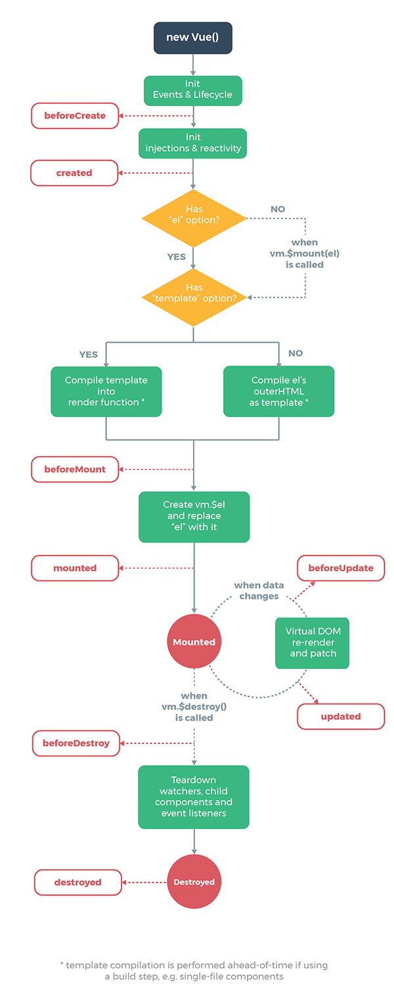

## 实例生命周期

> 每个Vue实例在被创建时都要经过一系列的初始化过程——例如，需要设置数据监听、编译模板、将实例挂载到DOM并在数据变化时更新 DOM 等。同时在这个过程中会自动运行一些叫做生命周期钩子的函数，我们可以使用这些函数，在实例的不同阶段加上我们需要的代码，实现特定的功能。

#### beforeCreate

在实例初始化之后，数据观测 (data observer) 和 event/watcher 事件配置之前被调用。

#### created

在实例创建完成后被立即调用。在这一步，实例已完成以下的配置：数据观测 (data observer)，属性和方法的运算，watch/event 事件回调。然而，挂载阶段还没开始

#### beforeMount

在挂载开始之前被调用：相关的 render 函数首次被调用。

#### mounted

实例挂载到dom之后被调用，可以当成是vue对象的ready方法来使用，一般用它来做dom的初始化操作。

#### beforeUpdate

数据发生变化前调用

#### updated

数据发生变化后调用

