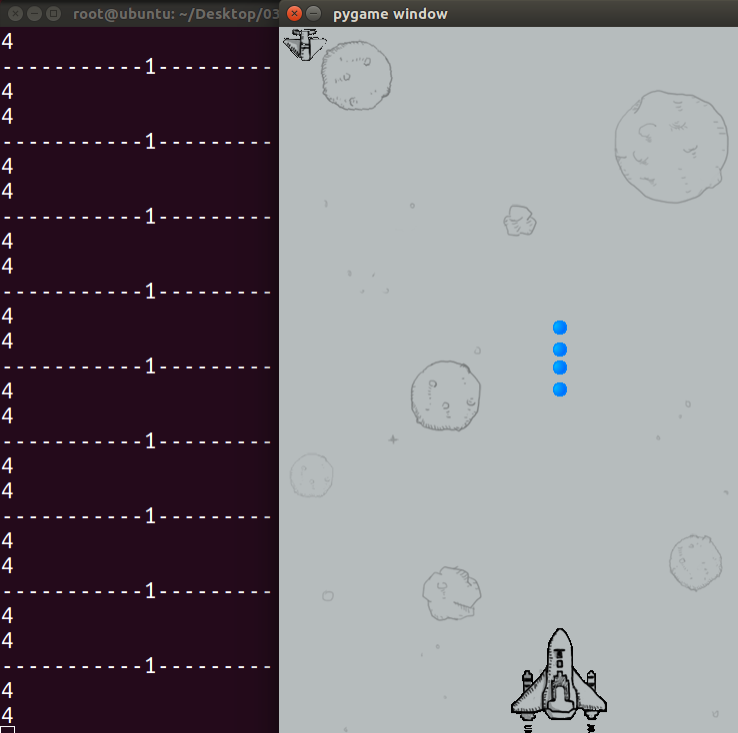

# 飞机大战代码：显示敌机



```python
import random
import pygame
import time
from pygame.locals import *

class HeroPlane(object):

    def __init__(self, screen):
        """初始化文件飞机"""
        self.x = 190
        self.y = 550

        image_path = 'feiji/hero1.png'
        self.image = pygame.image.load(image_path)

        self.screen = screen

        self.bullets = []  # 子弹列表

    def display(self):
        """显示玩家飞机"""
        self.screen.blit(self.image, (self.x, self.y))

    def display_bullets(self):
        """显示子弹列表"""
        for bullet in self.bullets[:]:  # 遍历列表时移除列表数据，最好使用切片生成一个新列表来遍历
            bullet.display()
            bullet.move()

            if bullet.is_out_screen():
                self.bullets.remove(bullet)

    def move_left(self):
        """向左移动"""
        self.x -= 10

    def move_right(self):
        """向右移动"""
        self.x += 10

    def shoot(self):
        """发射一颗新子弹"""
        bullet = HeroBullet(self.screen, self.x, self.y)
        self.bullets.append(bullet)


class EnemyPlane(object):
    """敌人飞机"""

    def __init__(self, screen):
        """初始化文件飞机"""
        self.x = 0
        self.y = 10

        image_path = 'feiji/enemy0.png'
        self.image = pygame.image.load(image_path)

        self.screen = screen

        self.orientation = 'right'

    def display(self):
        """显示玩家飞机"""
        self.screen.blit(self.image, (self.x, self.y))

    def move_left(self):
        """向左移动"""
        self.x -= 10

    def move_right(self):
        """向右移动"""
        self.x += 10

    def auto_move(self):
        """自动移动飞机"""
        if self.x <= 0:
            self.orientation = 'right'
        elif self.x >= 480-51:  # 写成计算表达式更容易阅读
            self.orientation = 'left'

        if self.orientation == 'right':
            self.move_right()
        elif self.orientation == 'left':
            self.move_left()


class HeroBullet(object):
    """玩家子弹类"""

    def __init__(self, screen, plane_x, plane_y):
        """初始化子弹类"""
        self.x = plane_x + 40
        self.y = plane_y - 22

        self.image = pygame.image.load('feiji/bullet.png')

        self.screen = screen

    def display(self):
        """显示子弹"""
        self.screen.blit(self.image, (self.x, self.y))

    def move(self):
        """移动子弹"""
        self.y -= 5

    def is_out_screen(self):
        """返回True表示已飞出屏幕"""
        return self.y < 0

    def __del__(self):
        """验证子弹是否被销毁"""
        print('子弹被销毁了')


def main():
    """游戏主程序"""
    # 创建窗口
    screen = pygame.display.set_mode((480, 700), 0, 32)

    # 加载背景图片
    bg = pygame.image.load('feiji/background.png')

    # 加载玩家飞机图片
    hero = HeroPlane(screen)

    # 加载敌人飞机
    enemy = EnemyPlane(screen)

    while True:
        # print('刷新界面')

        # 绘制背景图片
        screen.blit(bg, (0, 0))

        # 绘制玩家飞机
        hero.display()
        hero.display_bullets()

        # 绘制敌人飞机
        enemy.display()
        enemy.auto_move()

        # 刷新界面
        pygame.display.update()

        for event in pygame.event.get():

            # 判断是否是点击了退出按钮
            if event.type == QUIT:
                print("exit")
                exit()
            # 判断是否是按下了键
            elif event.type == KEYDOWN:
                # 检测按键是否是a或者left
                if event.key == K_a or event.key == K_LEFT:
                    print('left')
                    hero.move_left()

                # 检测按键是否是d或者right
                elif event.key == K_d or event.key == K_RIGHT:
                    print('right')
                    hero.move_right()

                # 检测按键是否是空格键
                elif event.key == K_SPACE:
                    print('space')
                    hero.shoot()

        time.sleep(1/60)  # 冻结代码，单位为 秒


if __name__ == '__main__':
    main()

```