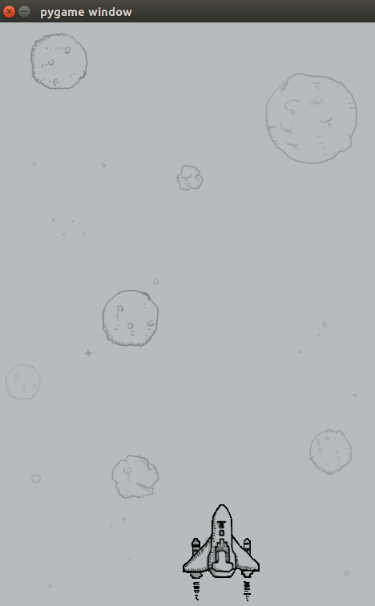

# 飞机大战代码：控制玩家飞机-面向过程




```python
import pygame
import time
from pygame.locals import *

def main():
    """游戏主程序"""
    # 创建窗口
    screen = pygame.display.set_mode((480, 700), 0, 32)

    # 加载背景图片
    bg = pygame.image.load('feiji/background.png')

    # 加载玩家飞机图片
    hero = pygame.image.load('feiji/hero1.png')
    x = 190
    y = 550

    while True:
        print('刷新界面')

        # 绘制背景图片
        screen.blit(bg, (0, 0))

        # 绘制玩家飞机
        screen.blit(hero, (x, y))

        # 刷新界面
        pygame.display.update()

        for event in pygame.event.get():

            # 判断是否是点击了退出按钮
            if event.type == QUIT:
                print("exit")
                exit()
            # 判断是否是按下了键
            elif event.type == KEYDOWN:
                # 检测按键是否是a或者left
                if event.key == K_a or event.key == K_LEFT:
                    print('left')
                    x -= 10

                # 检测按键是否是d或者right
                elif event.key == K_d or event.key == K_RIGHT:
                    print('right')
                    x += 10

                # 检测按键是否是空格键
                elif event.key == K_SPACE:
                    print('space')

    # time.sleep(600)  # 冻结代码，单位为 秒


if __name__ == '__main__':
    main()
    
```

